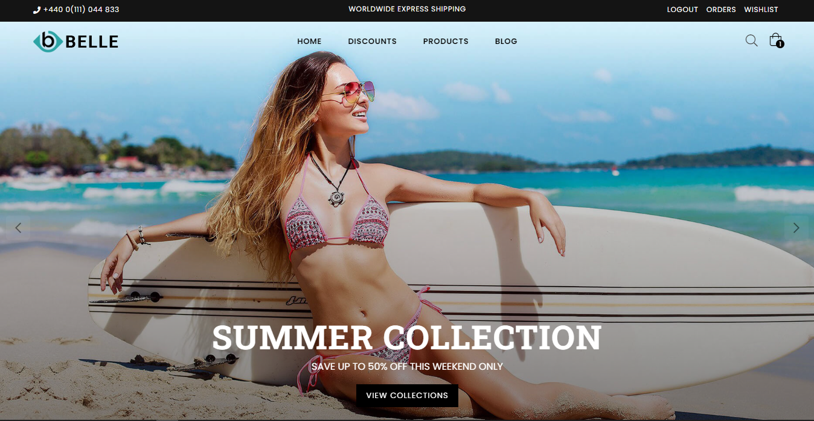
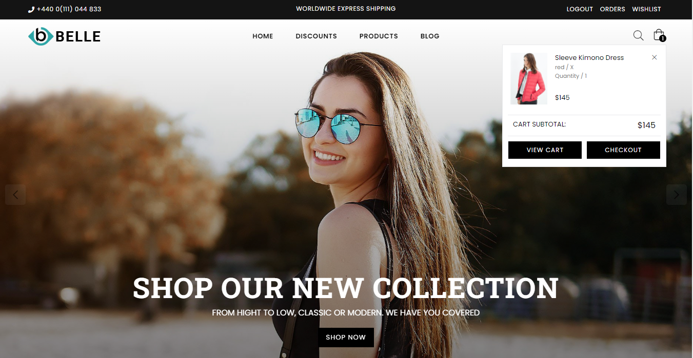
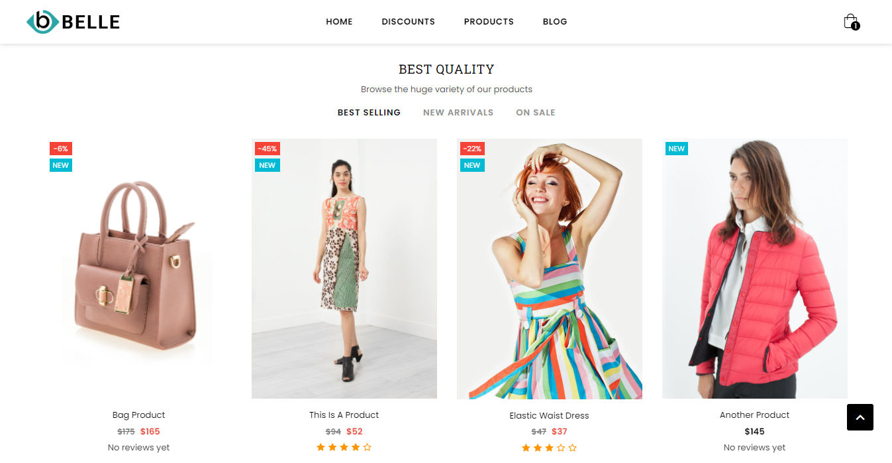
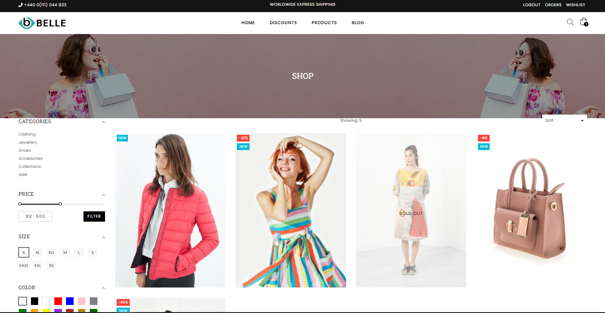

# Belle Ecommerce Website



Ecommerce website built using the Django web framework. This was based on a free bootstrap 
html template that can be found [here](https://www.templateshub.net/template/belle-multipurpose-bootstrap-html-template).

## Setup

Install all necessary modules with virtual env activated

`pip install Django`


Then, simply run the following commands to get started
```
git clone https://github.com/Lord-Psarris/Belle-ecommerce-website.git

cd Belle-ecommerce-website

python manage.py runserver
```

## Screenshots









